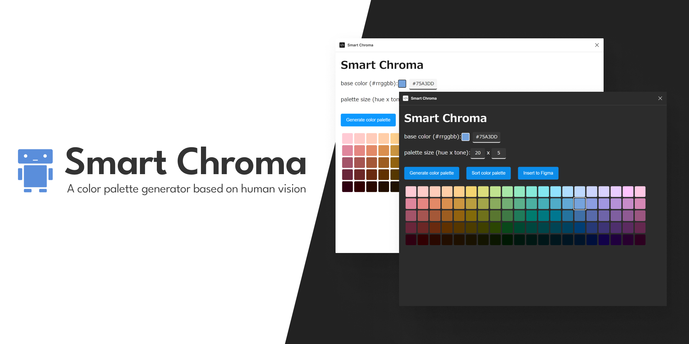

# Smart Chroma



Smart Chroma generates a color palette based on human vision.

If you create a color palette using a generic color space, the saturation and lightness of the appearance will appear to vary simply by changing the hue. This is because the saturation and lightness of the color space do not take human vision into account. This tool allows you to instantly and easily generate a color palette that takes human vision into account.

This tool is inspired by [Color Space](https://www.figma.com/community/plugin/1105513882835626049) and uses the [HCT color space](https://material.io/blog/science-of-color-design) internally. Source code available on [GitHub](https://github.com/Robot-Inventor/hct-color-palette).

## Installation

### Figma Plugin

Just install it from the [Figma Community](https://www.figma.com/community/plugin/1202157980535479255/Smart-Chroma).

### Standalone Version

First, run the following command.

```powershell
npm install
npm run build
```

Second, set up a local server and open ``site/dist/index.html``.

## Development

Here is a list of commands you can use during development.

```bash
npm run build
npm run dev # Watch all files
npm run serve # Watch only the site files and start a local server
npm run lint
npm run format
npm run format:check
```

## References

- [The Science of Color & Design - Material Design](https://material.io/blog/science-of-color-design)
- [Color Space: First plugin with HCT | Figma Community](https://www.figma.com/community/plugin/1105513882835626049)
- [material-color-utilities/typescript at main · material-foundation/material-color-utilities](https://github.com/material-foundation/material-color-utilities/tree/main/typescript)
- [Anatomy of Dynamic color | DroidKaigi 2022 - inSmartBank](https://blog.smartbank.co.jp/entry/2022/10/06/dynamic-color)
- [L\*a\*b\*値が同じなのに色が違うこともある？　CIELABは白基準で変わる | カラーマネジメント実践ブログ 〜フォトレタッチの現場から〜](https://omoide-photo.jp/blog/lab-reference-white/)
- [Node.js v19 の主な変更点 - 別にしんどくないブログ](https://shisama.hatenablog.com/entry/2022/10/19/010338)
- [【JavaScript】「html-to-image」ライブラリを使って指定した要素をSVG画像に変換する – 株式会社シーポイントラボ ｜ 浜松のシステム・RTK-GNSS開発](https://cpoint-lab.co.jp/article/202204/22633/)
- [bubkoo/html-to-image: ✂️ Generates an image from a DOM node using HTML5 canvas and SVG.](https://github.com/bubkoo/html-to-image)
