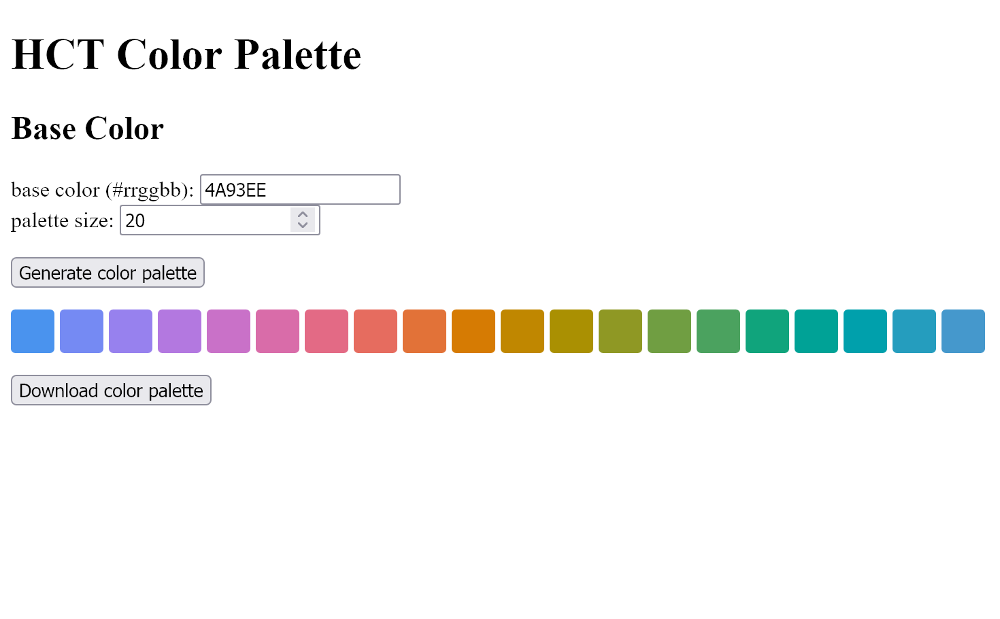

# hct-color-palette



HCT Color Palette generates a color palette by changing hue while preserving visual lightness and saturation. However, numerical lightness and saturation are not constant.

This tool was inspired by [Color Space](https://www.figma.com/community/plugin/1105513882835626049) and uses the [HCT color space](https://material.io/blog/science-of-color-design) internally.

## Usage

First, run the following command.

```powershell
npm install
npm run build
```

Second, set up a local server and open ``site/index.html``.

## Development

### Build

```powershell
npm run build
```

## References

- [The Science of Color & Design - Material Design](https://material.io/blog/science-of-color-design)
- [Color Space: First plugin with HCT | Figma Community](https://www.figma.com/community/plugin/1105513882835626049)
- [material-color-utilities/typescript at main · material-foundation/material-color-utilities](https://github.com/material-foundation/material-color-utilities/tree/main/typescript)
- [Anatomy of Dynamic color | DroidKaigi 2022 - inSmartBank](https://blog.smartbank.co.jp/entry/2022/10/06/dynamic-color)
- [L\*a\*b\*値が同じなのに色が違うこともある？　CIELABは白基準で変わる | カラーマネジメント実践ブログ 〜フォトレタッチの現場から〜](https://omoide-photo.jp/blog/lab-reference-white/)
- [Node.js v19 の主な変更点 - 別にしんどくないブログ](https://shisama.hatenablog.com/entry/2022/10/19/010338)
- [【JavaScript】「html-to-image」ライブラリを使って指定した要素をSVG画像に変換する – 株式会社シーポイントラボ ｜ 浜松のシステム・RTK-GNSS開発](https://cpoint-lab.co.jp/article/202204/22633/)
- [bubkoo/html-to-image: ✂️ Generates an image from a DOM node using HTML5 canvas and SVG.](https://github.com/bubkoo/html-to-image)
